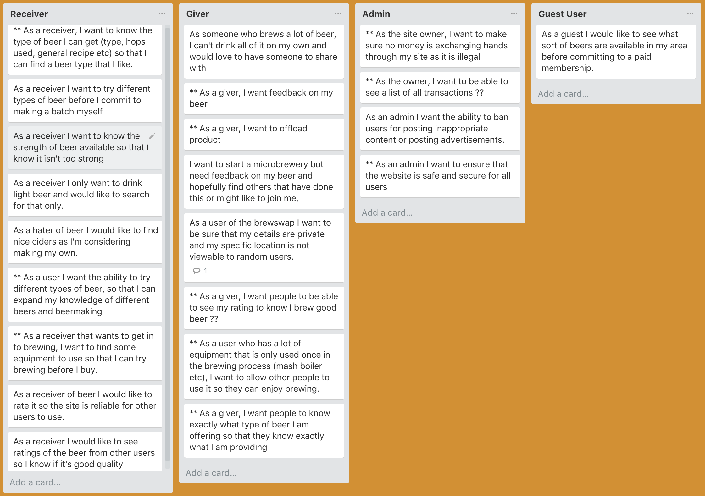
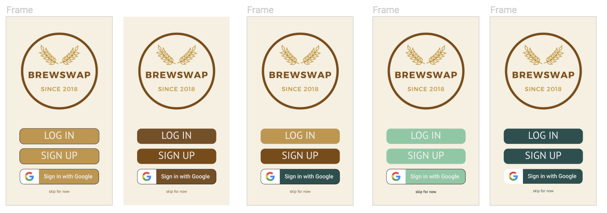

# BREWSWAP - a home brew swap app

https://brewswap2018.herokuapp.com/

https://github.com/waltandmartha/brewswap

**This is currently still under development and will be improved over time - pull requests welcome - design, planning and information below shows how final product should look and function**

## THE PROBLEM

Many people like beer(and/or cider) and many people enjoy drinking beer together. Currently there is no service in Australia that links home brew makers with each other with the intention of sharing and swapping beers. There are online forums, etc, but there is no platform for users to post what drinks they've made and what they'd like to share, and no way for keen beer drinkers to search different areas for new beers to try. This app attempts to solve this problem.

Also, there are currently limited ways for homebrewers to get feedback on their drinks. Brewswap would also assist with this enabling users to seek and give honest feedback.  In the 2017 Australian Home Brewer Survey only 28% of the 2500 respondents have ever entered a home brewing competition - “Considering this is a fantastic way for home brewers to get feedback on their beers, this is surprisingly low.” (https://www.beercartel.com.au/blog/2017-australian-home-brewer-survey-results/)

## THE SOLUTION

Brewswap allows users to post the home-brew they are creating and share it with other people with similar interests. Users can search their local area and connect with different home brewers and share their drinks, ideas and tips. It would be free to search and view the site but a yearly membership fee is required for members that wish to connect or post their own. If a user would like to post their home-brew on the site it is free to do so. They can also receive messages but will require to be a paid member to reply to messages. 

Brewswap will provide a lot more opportunities for home brewers to share and get feedback on their drinks, while also trying out other drinks they might like and finding new recipes to try and tips for brewing. 

This will be done through an app in which the user logs in and then is able to search using postcode and distance an area in which they are able to visit. The number of brewers willing to share or swap drinks in the designated area will show up and the user is then able to send them a message. 

There will be no sale of home-brew through the site as it is not possible without a license.  
This would involve using all the gems we have learnt in the last couple of weeks. 

### Additional features to add at a later date:
* Users could sell different home-brew related parts, items and ingredients which they no longer use, with 5% going to the website. This could be a popular addition - according to the 2017 Australian Home Brew Survey results - there are always new people getting into home brewing, and some people stopping, so it is possible that a marketplace for parts could be established.   

* Invite microbreweries to join up as users also, which helps them promote their brand.

## USER STORIES

The user stories were quite helpful in the design process, especially as I worked with a group (Cameo, Drew, Gen and me) to come up with all our user stories together. This made the process much more fun and also was a relatively quick process (once we got started). 

## USER JOURNIES

Although the below looks confusing at first glance it does actually make sense if you start from the home page in the top left and follow the possible journies for the user. This was very helpfull when figuring out the models I would need to create the app successfully. 

## ERD

# WIREFRAMES/FIGMA

The design for this app was much more complicated than our previous project. Having numerous pages for different functions made it quite difficult. Choosing my colours and fonts wasn't too hard as I knew immediately that I wanted beer-like colours - browns/oranges - so it was easy putting those together in a way that I thought looked good. Some of my pages looked a bit plain so I added in some soft focus beer images to be the background (after trying a couple of other options). The most challenging part of the design was the profile page. I felt like I was trying to fit too much on the one page. It was hard to remember that the user can always scroll down to see more info and that I should use that space if needed. 

The easiest part of the whole process was the logo design as someone else did that for me. I didn't even ask for it. I hadn't yet decided on a name for the app when the logo was made and the designer called it Brewswap. I liked the name immediately and after a few colour changes I suggested the logo was complete. 

My front page of the app was fairly straight-forward and user friendly. Just a simple layout with log in and register buttons. If I had more time I was going to add a google sign in button as in the design. I read the docs and it doesn't seem to difficult to do. 

Before deciding on the above design for the front page I played around with different colours and sought feedback from those around me. I think the simple browns looks much better overall and consistent with the rest of the site. 

I wanted the desktop version of the front page to match closely to this page but also have a menu at the top that would be consistent throughout the site. This memu appears at the bottom of the mobile view after sign-in. 

As part of the front page I included an 'About Page' and a 'FAQ' page. These are linked from the top menu but can also be scrolled down to. The background on this pages is fixed as the text boxes scroll over the top. 

Once a user is logged in (or if they skip login) they can browse posts submitted by other users. A list of posts would look like this:

Again the background image is fixed with each post scrolling over the top. If the user wanted to sort posts by a type, or location, etc. They can click on the 'sort by' menu which opens up over the top of the page, and the page fades out a little so there is no distraction while menu is open 

If the user selects one of the posts to view more information, that screen would look like this:

and includes a button to message the poster of the ad/brewer of the beer.

If a user wants to view their account page they can select 'My Account' at the bottom of any page. 

I struggled a bit with the layput of this page. It basically has the username at the top of the screen (the star next to the name indicates that this is a paid member of the site). Includes profile image, location, and a short bio, as well as recently tried beers, etc. There is a link to edit the bio and the profile picture links to change profile picture.

This view is of a user viewing their own account. But if another user was to veiw the account it would look something like this;

The search bar wouldn't be there anymore, I've changed that, but the rest would look similar.

If a user was to edit their profile they would get one of the two following screens depending on if they are a paid user or unpaid user. I'm not really happy with these, they're a bit plain, but I would look at fixing them up a bit once everything was up and running.

And finally I created a page of beer reviews which a user could browse. A key part of the app is getting feedback from users so the reviews need to be clear and easy to read.

This covers pretty much all of the figma design but to check it out all together the link is below. 

Figma designs: https://www.figma.com/file/IwT462wxPelQxgqpZzaOqhPs/Brewswap

## PLANNING

I set up a trello board for keeping track of what I was up to. It can be hard at times to remember what you are working on when an error distracts you. I was spending hours at a time (one error lasted two days) and then would have to remember what I was doing. Trello helped with this. I had a list of 'to do' 'do today' 'currently working on' 'done' which was helpful to keep track of things. 

I also had a list of all the gems I needed to use so I didn't forget anything (also it was a nice feeling putting them into the 'gems working' list).

I also had an error list and a fixed error list so I didn't forget what was broken. Although a lot of the time I worked on errors without adding them to the list.

My full trello board can be viewed here: https://trello.com/b/Gb3jlSW9

## GITHUB

I deployed to github and heroku early on in the process and kept doing so as each feature I added was working. I created a branch for my shrine gem and merged it back in when that was working. I was push numerous commits a day. 

## CODE REVIEWS

I had many errors and tried to figure them out myself but sometimes I needed assistance. Our class are so helpful that it feels like second nature to just help out when I can, and feel appreciative when someone else takes the time to help me out. 

The group we formed to work on the user stories (Cameo, Drew Gen and me) had a good understanding of each others projects from that exercise and I found myself being helped by them more than any others, not only in class, but we were all helping each other out through messages in Slack. 

## GEMS

Gems installed and successfully functioning:
* Devise
* Pundit
* Shrine
* Mailgun Rails
* Dotenv Rails
* Country Select
* Image Processing
* Mini Magick
* Rspec Rails (in development/test)

Gems yet to be installed/function
* Stripe (installed, not yet functioning)
* Geocoder

## THE BUILD PROCESS
### CHALLENGES

There were many many challenges. I think the top two challenges were: 
* the timeframe
    * 2 weeks did not feel like enough time to complete the whole process with just one person working on it. From design through to deployment, and with us all new to Rails, it felt almost impossible to finish this to a standard I am happy with in the given time. 

* no team
    * I think I prefer working as part of a team, with a team you have people to bounce ideas off, people can work to their strenths and contribute to a successful project. Perhaps the two weeks would be long enough if we had been working in pairs, or more. 

There were probably too many challenges to list here. Most errors were a challenge, though there were times when I'd get a series of errors and easily deal with them and have a working app at the end. But there were some errors which were really tricky. My worst error was having a form within a form. This is not something I would try to do again anytime soon. This error held up my progress for almost 2 days. 

Basically, my form for a user to create a post involves two models. The post model and the drink model. The post model is the basic 'title', 'description' and 'image'. The drink model had all the drink details 'amount in mls', 'number of bottles', 'beer type', etc. 

I wanted users to have the flexibility of posting general posts though most of the time they would be posting their drinks to swap and share. 

The problem was that the drinks part of the form wasn't saving. It could be filled out and submitted and it would create a drink object, but all the fields would return 'nil'. This problem stumped Matt for quite a while as well. It finally worked one afternoon but by the end of the day was broken again after I got the profile form working. So I has this error over two night. I had pushed to github after it was working and checked each file against that to try to fix it when it wasn't working the second time but that didn't fix it. I ended up figuring it out on my own which I was quite proud of. When I defined the drinks params in the Posts Controller the form started saving properly. A completely different solution to what Matt had got working the day before (which no longer worked).

### FAVOURITE PARTS

Even though we worked individually my favourite part was the collaboration with everyone helping each other out with errors, problems, and just sharing ideas and new finds that were helpful. 

My other favourite part was when I would have an error no longer appear. Always a good feeling when you click something and it does what it is supposed to. 

I enjoyed when things just worked like they were supposed to. Mailgun seemed really painless for me and seems to be working well. I was really happy with my progress in the first couple of days when I got things working as they should. Shrine caused me a couple of small problems but nothing major. It was mainly my form that held me up.

Even though the design was hard, I enjoyed that as well, a lot more than last time. It was good having a clear understanding of the app before beginning. 

